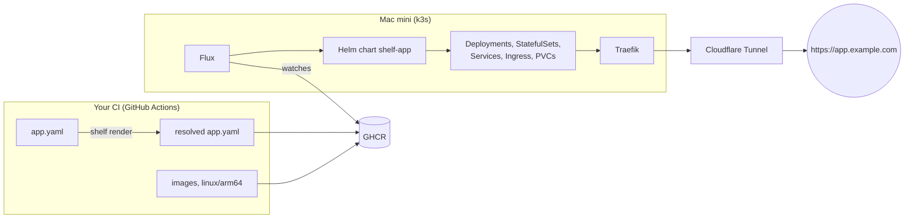

# shelf

**A small, self-hosted app platform for a single Apple Silicon Mac mini.**

Describe your app in one short `app.yaml`, build your images in your own CI, and shelf runs
them on Kubernetes: with persistent volumes, generated secrets, health checks and a public URL
at `<app>.<your-domain>`.

> [!WARNING]
> shelf is a learning project for platform engineering. It is **not meant for production**,
> and it is **still under construction**: today the CLI can validate and render an app. It
> cannot deploy one yet. See [Status](#status).

## Contents

- [Why shelf](#why-shelf)
- [How it works](#how-it-works)
- [Status](#status)
- [Quick start](#quick-start)
- [Writing an `app.yaml`](#writing-an-appyaml)
- [CLI reference](#cli-reference)
- [Developing shelf](#developing-shelf)
- [Further reading](#further-reading)

## Why shelf

Running a few side projects on a machine at home usually means handwritten Kubernetes
manifests, or a pile of `docker run` commands. shelf sits in between:

- **One file per app.** Components, ports, routes, volumes and secrets go in a single
  `app.yaml`. shelf turns it into Deployments, StatefulSets, Services, Ingresses and PVCs.
- **Your CI stays yours.** Your pipeline builds the images and pushes them to GitHub Container
  Registry (GHCR). shelf never talks to Git or to your forge: the registry is the only
  interface.
- **Secrets never show up in manifests.** Passwords are generated on the platform and
  referenced as `${secrets.db-password}`.
- **Standard building blocks.** Flux, Helm, Traefik, Cloudflare Tunnel and external-dns do the
  heavy lifting. shelf is mostly glue.
- **Apps are isolated.** Each app gets its own namespace, and nothing is shared between apps.

## How it works



1. Your workflow builds the images and runs `shelf render` on your `app.yaml`. This pins every
   image to a digest, fills in host names and ports, and checks your file.
2. It pushes the result to GHCR as a small deploy artifact.
3. Flux on the Mac mini notices the new artifact and hands it to the generic `shelf-app` Helm
   chart, which creates the Kubernetes objects.
4. Traefik routes requests by host name, and a Cloudflare Tunnel makes the app reachable from
   the internet without opening ports.

The design, all decisions and the roadmap are in [docs/plan.md](docs/plan.md).

## Status

shelf is built in phases. After each phase the maintainer reviews the result before the next
one starts.

| Phase | Content | State |
|---|---|---|
| 0 | Devcontainer, local k3d cluster, smoke tests | ✅ done |
| 1 | `app.yaml` schema, `shelf validate`, `shelf render`, CI | ✅ done |
| 0b | Switch the devcontainer to Docker-in-Docker | ✅ done |
| 2 | Helm chart `shelf-app` | ✅ done |
| 3 | `shelf init cluster`: Flux, Traefik | ✅ done |
| 4 | Delivery: deploy artifact, `shelf app add` / `rm`, reusable workflow | 🔧 in progress |
| 5 | `shelf init expose`: Cloudflare Tunnel, DNS | planned |
| 6 | Installation on the Mac mini | planned |
| 7 | Reference apps | planned |

## Quick start

There are no release binaries yet. Build the CLI from source (Go 1.27 or later):

```sh
git clone https://github.com/tweinmann/shelf.git
cd shelf
go build -o bin/shelf ./cmd/shelf
```

Check the example app. `validate` works offline:

```console
$ bin/shelf validate examples/hello/app.yaml
examples/hello/app.yaml: valid
```

Render it. This looks up the images in their registries:

```console
$ bin/shelf render -o app examples/hello/app.yaml
apiVersion: shelf.dev/v1alpha1
name: hello
components:
  db:
    image: postgres:16@sha256:f1c3376c…
    ports:
      main: 5432
    ...

App hello (namespace hello):
  check  Deployment × 1   postgres:16@sha256:f1c3376c…
  db     StatefulSet × 1  postgres:16@sha256:f1c3376c…
         Service db       main=5432
         PVC data-db-0    1Gi at /var/lib/postgresql/data
  web    Deployment × 2   traefik/whoami:v1.11.0@sha256:20068979…
         Service web      main=80
         Route            / → port main
  secret db-password (generated) → env SHELF_SECRET_DB_PASSWORD
```

The manifest goes to stdout and the summary to stderr, so you can redirect the manifest to a
file.

## Writing an `app.yaml`

A complete example with a web frontend, an API and a Postgres database:

```yaml
# yaml-language-server: $schema=https://raw.githubusercontent.com/tweinmann/shelf/main/schema/app.schema.json
apiVersion: shelf.dev/v1alpha1
name: shop                       # becomes the namespace and shop.<your-domain>

components:
  web:
    image: ghcr.io/you/shop-web:1.4.0
    port: 8080
    route: /                     # reachable from outside
    instances: 2
    health: { path: /healthz }
    resources: { cpu: 500m, memory: 512Mi }

  api:
    image: ghcr.io/you/shop-api:1.4.0
    port: 3000
    route: /api
    env:
      DATABASE_URL: postgres://app:${secrets.db-password}@${db.host}:${db.port}/shop
    volumes:
      uploads: { path: /data/uploads, size: 5Gi }

  db:
    image: postgres:16
    port: 5432                   # no route: only reachable inside the app
    env:
      POSTGRES_USER: app
      POSTGRES_PASSWORD: ${secrets.db-password}
      POSTGRES_DB: shop
      PGDATA: /var/lib/postgresql/data/pgdata
    volumes:
      data: { path: /var/lib/postgresql/data, size: 20Gi }

secrets:
  db-password: { generate: true }
```

The first line gives you autocompletion and inline checks in VS Code (with the YAML extension)
and other editors that support JSON Schema. `shelf schema` prints the same schema.

### Component fields

| Field | Meaning |
|---|---|
| `image` | Image reference (required). `shelf render` pins tags to a digest. The image must provide `linux/arm64`. |
| `command`, `args` | Override the image's entrypoint and command, as in Kubernetes. |
| `env` | Environment variables as a map. Numbers and booleans are fine (`PORT: 8080`). |
| `port` | The single port the container listens on. |
| `ports` | Several named ports, e.g. `{ http: 8080, metrics: 9100 }`. Use either `port` or `ports`. |
| `route` | Makes the component reachable from outside: `route: /api`, or `route: { path: /api, port: http, stripPrefix: true }`. The long form is required when the component has several ports. |
| `instances` | Number of replicas, default 1. Replicas do not form a cluster; that is up to your app. |
| `volumes` | Persistent volumes: `name: { path, size }`. A component with volumes runs as a StatefulSet. |
| `health` | HTTP probe: `{ path, port?, initialDelay? }`, with `initialDelay` in seconds. It tells Kubernetes (and your deploy) when the component is ready. |
| `resources` | `{ cpu, memory }` requests. Memory is also the hard limit, which protects the other apps on the machine. |

### References

Inside `env`, `command` and `args` you can use:

| Reference | Becomes |
|---|---|
| `${db.host}` | the host name of component `db` |
| `${db.port}` | its port, if it has exactly one |
| `${api.ports.metrics}` | a named port |
| `${secrets.db-password}` | the secret value, injected at runtime; it never appears in any manifest |

`$` works like in docker compose: `$$` is a literal `$`, and a `$` that is not followed by `{`
stays as it is. So `sh -c 'echo $HOME'` works without escaping.

### Things to know

- **Volume sizes are not enforced.** The local storage on the Mac mini does not limit
  capacity, so `size` is documentation. A component can fill the disk.
- **Plan volumes up front.** Kubernetes does not allow changing the volumes of a StatefulSet in
  place, and the local storage cannot grow, so changing an existing volume later needs manual
  steps. Giving a component its first volumes, or removing all of them, works: the component
  restarts, and `${<component>.host}` keeps pointing at it. **Removing volumes deletes their
  data.**
- **Names:** app and component names use lowercase letters, digits and `-`, and are at most
  40 characters long. `secrets`, `app` and `shelf` are reserved component names, and component
  names must not end with `-headless`.
- **Secrets:** only generated secrets (`generate: true`) are supported for now. Generated
  values are URL-safe, so you can put them into connection strings as they are.

## CLI reference

| Command | What it does |
|---|---|
| `shelf validate <app.yaml>...` | Checks one or more files without network access. Errors and warnings show file, line and field. Exits with 1 on errors. |
| `shelf render <app.yaml>` | Validates, resolves images and prints the deploy manifest (a ConfigMap). `-o app` prints the resolved `app.yaml` instead. Registry credentials come from `docker login`. |
| `shelf schema` | Prints the JSON Schema for `app.yaml`. |
| `shelf init cluster` | Installs Flux and the platform (Traefik) into the cluster of the current kubecontext, and waits until everything is ready. Shows the target cluster and asks before changing anything (`--yes` skips the question); `--context` and `--kubeconfig` pick another cluster. Safe to run again. |
| `shelf version` | Prints the version. |

Example of an error message:

```text
app.yaml:12: error: components.web.route: route needs a port; add port or ports to the component
```

Commands for adding apps (`shelf app add`) and for the Mac mini (`shelf init host`) follow in
later phases.

## Developing shelf

All development happens in a [devcontainer](https://containers.dev). On your machine you only
need Docker Desktop and VS Code with the Dev Containers extension. Every tool version is pinned
in [.devcontainer/Dockerfile](.devcontainer/Dockerfile).

The devcontainer runs its own Docker daemon (Docker-in-Docker, which makes it a privileged
container), and the local Kubernetes cluster runs inside it. Your other Docker containers stay
out of reach.

1. Open the repository in VS Code and choose **Reopen in Container**.
2. Run the checks, the same ones CI runs:

   ```sh
   just test
   ```

Useful commands:

| Command | Purpose |
|---|---|
| `just test` | Formatting, `go vet`, unit tests, chart lint and golden files, manifest validation, examples |
| `just golden` | Rewrite golden files and `schema/app.schema.json` after an intended change |
| `just build` | Build `bin/shelf` |
| `just cluster-up` / `cluster-stop` / `cluster-down` / `cluster-reset` | Manage the local k3d cluster `shelf-dev` |
| `just platform-push`, `just init-cluster` | Push `platform/` to the local registry and install it with `shelf init cluster` |
| `just smoke-secrets`, `just smoke-registry <image>`, `just smoke-chart`, `just smoke-init` | Smoke tests against the local cluster; `smoke-chart` installs `examples/hello` with the chart, `smoke-init` checks `shelf init cluster` and routing through Traefik |
| `hack/nuke.sh` | **Run in a terminal on your machine, not in the container.** Removes every Docker object shelf created. |

On your machine's Docker daemon, shelf only creates the devcontainer with its image and
volumes, as listed in [docs/plan.md](docs/plan.md#footprint-on-the-existing-docker-desktop-setup).
`hack/nuke.sh` removes exactly those, by name. The cluster disappears with them.

Repository layout:

```text
cmd/shelf/          CLI entry point
internal/           schema, validation, rendering, cluster installation, CLI
charts/shelf-app/   the generic Helm chart every app is installed with
platform/           what Flux installs into every cluster (Traefik)
schema/             generated JSON Schema for app.yaml
examples/hello/     reference app
hack/               dev cluster, platform push, smoke tests, cleanup
docs/plan.md        design, decisions, phase plan
```

## Further reading

- [docs/plan.md](docs/plan.md): architecture, decisions, the schema in detail, and the phase
  plan
- [CLAUDE.md](CLAUDE.md): working agreements for AI-assisted development in this repository
